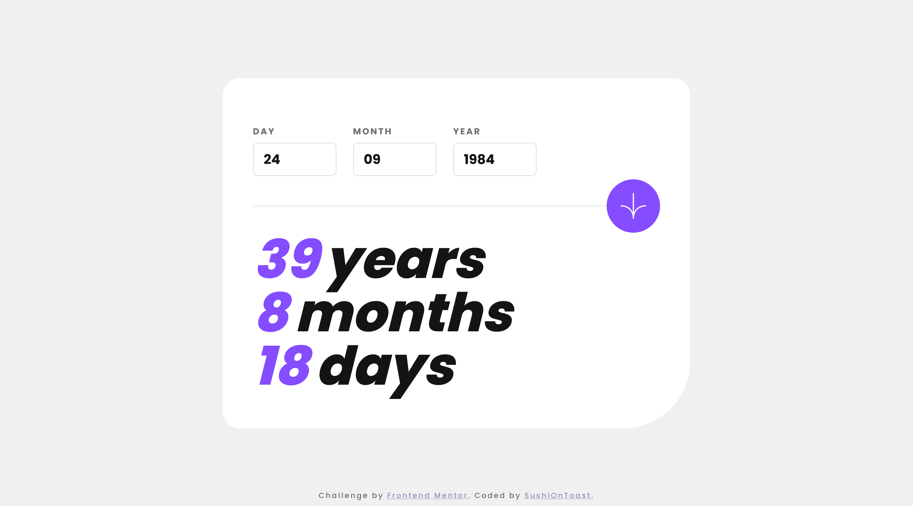

# Frontend Mentor - Age calculator app solution

This is a solution to the [Age calculator app challenge on Frontend Mentor](https://www.frontendmentor.io/challenges/age-calculator-app-dF9DFFpj-Q). Frontend Mentor challenges help you improve your coding skills by building realistic projects. 

## Table of contents

- [Overview](#overview)
  - [The challenge](#the-challenge)
  - [Screenshot](#screenshot)
  - [Links](#links)
- [My process](#my-process)
  - [Built with](#built-with)
  - [What I learned](#what-i-learned)
  - [Useful resources](#useful-resources)
- [Author](#author)

## Overview

### The challenge

Users should be able to:

- View an age in years, months, and days after submitting a valid date through the form
- Receive validation errors if:
  - Any field is empty when the form is submitted
  - The day number is not between 1-31
  - The month number is not between 1-12
  - The year is in the future
  - The date is invalid e.g. 31/04/1991 (there are 30 days in April)
- View the optimal layout for the interface depending on their device's screen size
- See hover and focus states for all interactive elements on the page
- **Bonus**: See the age numbers animate to their final number when the form is submitted

### Screenshot



### Links

- Solution URL: [Available on github pages](https://sushiontoast.github.io/frontend-mentor-newsletter-sign-up-challenge/)

## My process

### Built with

- Semantic HTML5 markup
- CSS
- JavaScript

### What I learned

I really had a lot of fun with animating the numbers when displaying the result on the screen; it was a tricky but rewarding exercise.

Animating the numbers counting up:
```js
function animateValue(obj, start, end, animationDuration) {
    let startingTime = null;

    const step = (currentTime) => { // animate each 'frame'
        if (!startingTime) startingTime = currentTime;
        const progress = Math.min((currentTime - startingTime) / animationDuration, 1);
        obj.textContent = Math.floor(progress * (end - start) + start);
        if (progress < 1) {
            window.requestAnimationFrame(step);
        }
    };

    window.requestAnimationFrame(step); // starting the animation
}
```
The `window.requestAnimationFrame(step)` really came in handy here!

Putting the animation together:
```js
async function displayResult() {
    animateValue(document.querySelector('#no-of-years'), 0, years, 500);
    await sleep(500);
    animateValue(document.querySelector('#no-of-months'), 0, months, 500);
    await sleep(500);
    animateValue(document.querySelector('#no-of-days'), 0, days, 500);
}
```
`sleep()` function:
```js
function sleep(milliseconds) {
    return new Promise(resolve => setTimeout(resolve, milliseconds));
}
```

I used the await keyword in the `displayResult()` function since promises are asynchronous, so i had to make sure the carry out the promise in the `sleep()` function first before animating the next number. This enabled me to create a time delay.

Overall, this was a really interesting and fun project!

### Useful resources

- [W3schools](https://www.w3schools.com/css/) - Helped me with styling certain elements
- [MDN web docs](https://developer.mozilla.org/en-US/) - Helped me a lot with the fetch API and a great general reference
- [Sitepoint blogs](https://www.sitepoint.com/javascript/) - explained JavaScript concepts really well

## Author

- Frontend Mentor - [@SushiOnToast](https://www.frontendmentor.io/profile/SushiOnToast)
- CodePen - [@SushiOnToast](https://codepen.io/SushiOnToast)
- CodeWars - [@SushiOnToast](https://www.codewars.com/users/SushiOnToast)